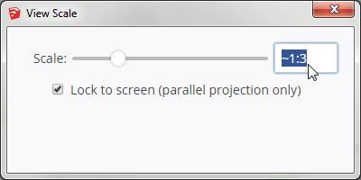

# Scale

Class representing the scale of a view or a drawing. Can parse scales from
numerous formats such as `"1:100"`, `"1%"`, `0.01` or `"1'=1200\""`. Can round
scales to reasonable values such as 1:10, 1:20, 1:50, 1:100 etc.

*Scale class in action in Eneroth View Scale*

## Installation

1. Place file inside your extension's directory, preferably in a sub-directory called vendor to distinguish it from your own code base.
2. Wrap file content in your extension's namespace.
3. Require the file from files depending on it.
